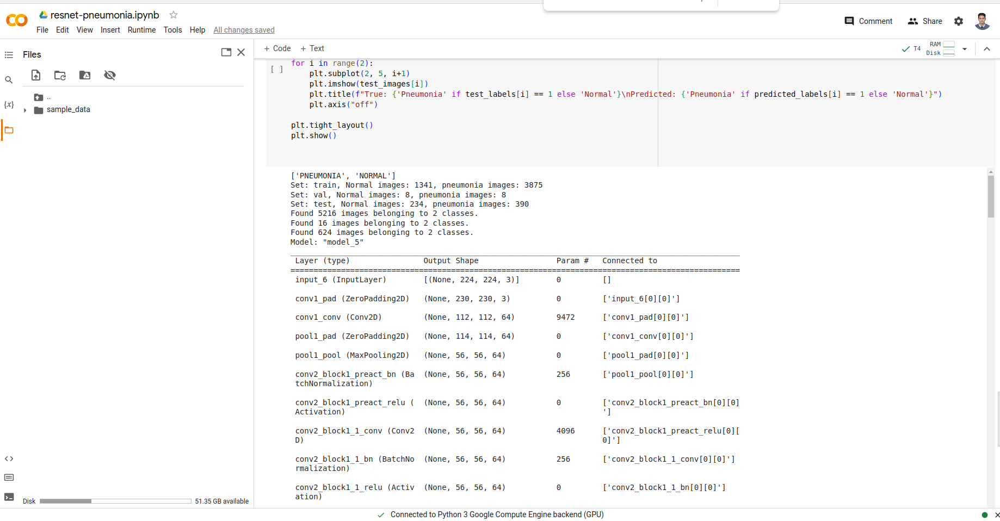
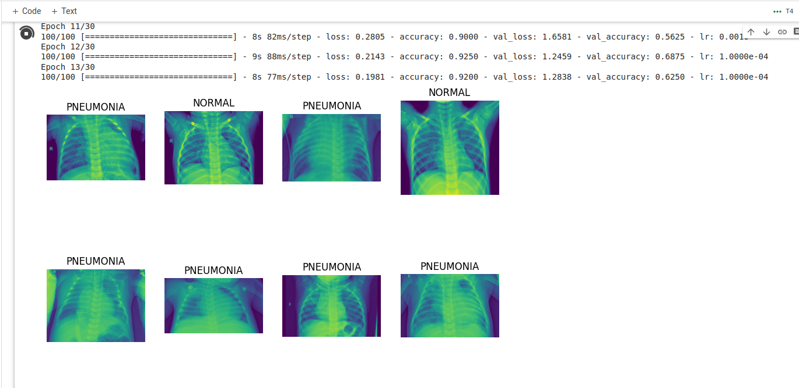
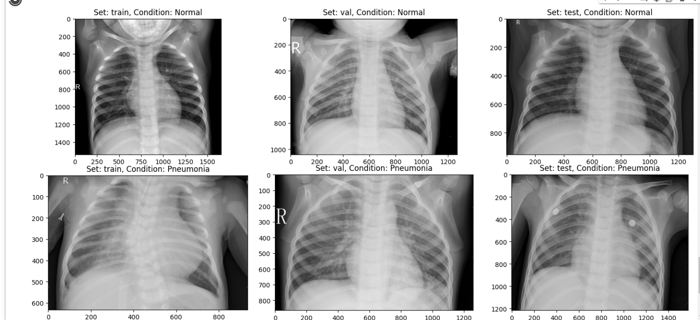
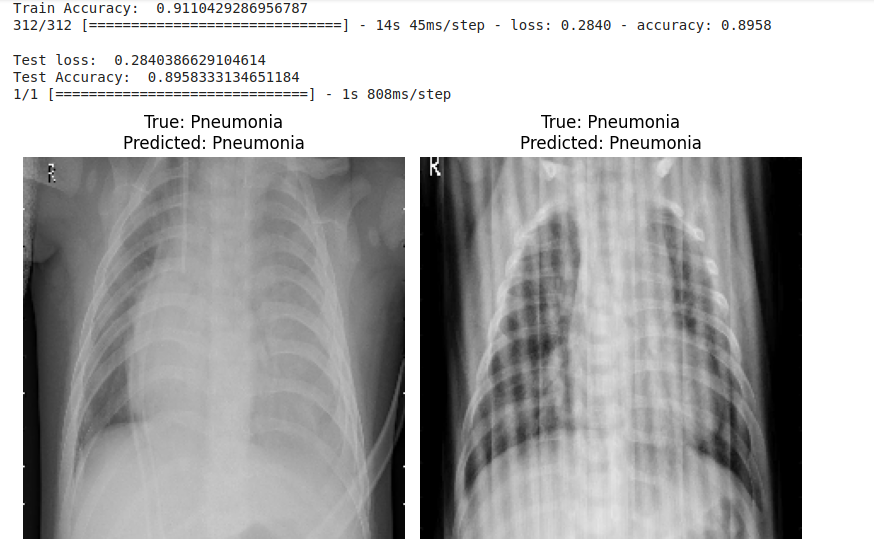

# Pneumonia Detection using ResNet50

This project uses a pre-trained ResNet50V2 model to detect pneumonia from chest X-ray images. The model is fine-tuned on a dataset of chest X-ray images and uses data augmentation to improve generalization.

## Dataset

The dataset used in this project is the Chest X-ray Images (Pneumonia) dataset available on Kaggle. It contains images categorized into three sets: training, validation, and test.

Training data can be downloaded from Kaggle: [Chest X-ray Images (Pneumonia)](https://www.kaggle.com/datasets/paultimothymooney/chest-xray-pneumonia?resource=download)

## Requirements

- Python 3.x
- TensorFlow
- Keras
- NumPy
- Pandas
- Matplotlib
- PIL (Python Imaging Library)

## Final Images

- Initial images count

- Printing random images from normal and pneumonia directory

- Printing train, test and validation images

- Final Prediction

